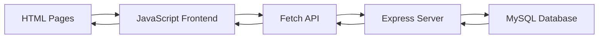

## Overview

The Hotel Reservation System uses a modern JavaScript frontend that communicates with a Node.js/Express backend via REST API. This guide explains the complete integration architecture, API patterns, and best practices.

<Note>
  The frontend uses vanilla JavaScript with the Fetch API, Bootstrap 5 for UI components, and follows RESTful conventions for all API communication.
</Note>

## Architecture Overview

### System Components



### Technology Stack

<CardGroup cols={2}>
  <Card title="Frontend" icon="browser">
    - HTML5
    - Vanilla JavaScript (ES6+)
    - Bootstrap 5
    - Fetch API
  </Card>
  
  <Card title="Backend" icon="server">
    - Node.js
    - Express.js
    - MySQL2
    - CORS
    - Body-Parser
  </Card>
</CardGroup>

## Backend Configuration

### Server Setup

The backend server is configured in `server.js`:

```javascript
const express = require('express');
const bodyParser = require('body-parser');
const clientesRouter = require('./router/clientes.Router');
const habitacionRouter = require('./router/habitaciones.Router');
const reservacionRouter = require('./router/reservaciones.Router');
const cors = require("cors");

// Create Express instance
const app = express();

// Define port
const PORT = 4000;

// Configure Middleware
app.use(cors());
app.use(bodyParser.json());
app.use(clientesRouter);
app.use(habitacionRouter);
app.use(reservacionRouter);

// Start server
app.listen(PORT, () => {
    console.log(`Servidor iniciado en el puerto ${PORT}`);
});
```

**Key Components:**
- **CORS**: Enables cross-origin requests from the frontend
- **Body-Parser**: Parses JSON request bodies
- **Routers**: Modular route handlers for each resource
- **Port 4000**: Server listens on localhost:4000

### Database Connection

The database configuration in `model/database.js`:

```javascript
const mysql = require('mysql2');

// Create connection object
const conexion = mysql.createConnection({
    host: 'localhost',
    user: 'root',
    password: '1234',
    database: 'BDReservacion'
});

// Establish connection
conexion.connect((err) =>{
    if (err) throw err;
    console.log("Conexion exitosa a la base de datos")
});

// Export connection
module.exports = conexion;
```

**Configuration Details:**
- **Host**: localhost (development environment)
- **User**: root
- **Database**: BDReservacion
- **Connection**: Persistent connection shared across all controllers

<Warning>
  Never commit database credentials to version control. Use environment variables in production.
</Warning>

## API Routes

### Client Routes

Defined in `router/clientes.Router.js`:

```javascript
const express = require('express');
const service = require('../controllers/clientes.controllers');

const router = express.Router();

router.get('/clientes', service.obtenerListClientesService);
router.post('/clientes', service.addDataCliente);
router.put('/clientes/:id', service.updateDataCliente);
router.delete('/clientes/:id', service.deleteDataCliente);

module.exports = router;
```

### Room Routes

Defined in `router/habitaciones.Router.js`:

```javascript
const express = require('express');
const service = require('../controllers/habitaciones.controllers');

const router = express.Router();

router.get('/habitaciones', service.obtenerListHabitacionesService);
router.post('/habitaciones', service.addDataHabitaciones);
router.put('/habitaciones/:id', service.updateDataHabitaciones);
router.delete('/habitaciones/:id', service.deleteDataHabitaciones);

module.exports = router;
```

### Reservation Routes

Defined in `router/reservaciones.Router.js`:

```javascript
const express = require('express');
const service = require('../controllers/reservaciones.controllers');

const router = express.Router();

router.get('/reservaciones', service.obtenerListReservacionesService);
router.post('/reservaciones', service.addDataReservaciones);
router.put('/reservaciones/:id', service.updateDataReservaciones);
router.delete('/reservaciones/:id', service.deleteDataReservaciones);

module.exports = router;
```

<Note>
  All routes follow RESTful conventions with consistent patterns across resources.
</Note>

## Frontend API Integration

### Fetch API Patterns

The frontend uses the Fetch API for all HTTP requests. Here are the common patterns:

<Tabs>
  <Tab title="GET Request">
    **Retrieving Data**

    ```javascript
    const URL = 'http://localhost:4000/clientes';

    async function loadDataCliente() {
        try {
            const response = await fetch(URL);
            const data = await response.json();
            
            // Process data
            console.log(data);
            
        } catch (error) {
            console.error('Error:', error);
        }
    }
    ```

    **Key Points:**
    - Default method is GET
    - Use `response.json()` to parse JSON response
    - Always wrap in try-catch for error handling
  </Tab>

  <Tab title="POST Request">
    **Creating Data**

    ```javascript
    const URL = 'http://localhost:4000/clientes';

    async function guardarDataCliente() {
        const dataCliente = {
            nombre: document.getElementById("clientName").value,
            correo: document.getElementById("clientEmail").value,
            telefono: document.getElementById("clientPhone").value
        };

        try {
            const response = await fetch(URL, {
                method: "POST",
                headers: { 'Content-Type': 'application/json' },
                body: JSON.stringify(dataCliente)
            });

            if (!response.ok) throw new Error('Error al guardar cliente');

            const result = await response.json();
            console.log(result);

        } catch (error) {
            console.error('Error:', error);
        }
    }
    ```

    **Key Points:**
    - Method must be explicitly set to "POST"
    - Content-Type header is required
    - Body must be JSON stringified
    - Check response.ok for success
  </Tab>

  <Tab title="PUT Request">
    **Updating Data**

    ```javascript
    const URL = 'http://localhost:4000/clientes';

    async function actualizarDataCliente(id) {
        const dataCliente = {
            nombre: document.getElementById("clientNameU").value,
            correo: document.getElementById("clientEmailU").value,
            telefono: document.getElementById("clientPhoneU").value
        };

        try {
            const response = await fetch(`${URL}/${id}`, {
                method: "PUT",
                headers: { 'Content-Type': 'application/json' },
                body: JSON.stringify(dataCliente)
            });

            if (!response.ok) throw new Error('Error al actualizar cliente');

            const result = await response.json();
            console.log(result);

        } catch (error) {
            console.error('Error:', error);
        }
    }
    ```

    **Key Points:**
    - Method set to "PUT"
    - ID appended to URL
    - Same headers and body format as POST
  </Tab>

  <Tab title="DELETE Request">
    **Deleting Data**

    ```javascript
    const URL = 'http://localhost:4000/clientes';

    async function deleteDataCliente(id) {
        try {
            const response = await fetch(`${URL}/${id}`, { 
                method: "DELETE" 
            });
            
            if (!response.ok) throw new Error('Error al eliminar cliente');

            const result = await response.json();
            console.log(result);

        } catch (error) {
            console.error('Error:', error);
        }
    }
    ```

    **Key Points:**
    - Method set to "DELETE"
    - ID appended to URL
    - No body required
    - No special headers needed
  </Tab>
</Tabs>

## Complete Integration Example

Here's a complete example showing the full request/response cycle:

### Frontend: Creating a Client

```javascript
// File: js/scripts.js
const URL = 'http://localhost:4000/clientes';

async function guardarDataCliente() {
    // 1. Collect form data
    const dataCliente = {
        nombre: document.getElementById("clientName").value,
        correo: document.getElementById("clientEmail").value,
        telefono: document.getElementById("clientPhone").value
    };

    // 2. Send POST request
    try {
        const response = await fetch(URL, {
            method: "POST",
            headers: { 'Content-Type': 'application/json' },
            body: JSON.stringify(dataCliente)
        });

        // 3. Check response
        if (!response.ok) throw new Error('Error al guardar cliente');

        // 4. Parse response
        const result = await response.json();
        console.log(result); // { message: "Cliente agregado" }

        // 5. Reload data
        loadDataCliente();

    } catch (error) {
        console.error(error);
    }
}
```

### Backend: Processing the Request

<Steps>

### Step 1: Route Handler

```javascript
// File: router/clientes.Router.js
router.post('/clientes', service.addDataCliente);
```

### Step 2: Controller

```javascript
// File: controllers/clientes.controllers.js
exports.addDataCliente = (req, res) => {
    // Extract data from request body
    const { nombre, correo, telefono } = req.body;
    
    // Define SQL query
    const SQL = "INSERT INTO `cliente` (nombre, correo, telefono) VALUES (?, ?, ?)";
    
    // Execute query
    conexion.query(SQL, [nombre, correo, telefono], (err, results) => {
        if (err) throw err;
        
        // Send response
        res.json({ message: "Cliente agregado" });
    });
};
```

### Step 3: Database Operation

```sql
INSERT INTO `cliente` (nombre, correo, telefono) 
VALUES ('Juan Pérez', 'juan@example.com', '555-0123');
```

### Step 4: Response

```json
{
  "message": "Cliente agregado"
}
```

</Steps>

## Error Handling

### Frontend Error Handling

```javascript
async function fetchWithErrorHandling(url, options = {}) {
    try {
        const response = await fetch(url, options);
        
        // Check if response is ok (status 200-299)
        if (!response.ok) {
            // Try to parse error message from response
            const errorData = await response.json().catch(() => ({}));
            throw new Error(errorData.message || `HTTP error! status: ${response.status}`);
        }
        
        // Parse successful response
        return await response.json();
        
    } catch (error) {
        // Network errors, parsing errors, or thrown errors
        if (error.name === 'TypeError') {
            // Network error
            console.error('Error de red:', error);
            alert('No se puede conectar al servidor. Verifique su conexión.');
        } else {
            // Other errors
            console.error('Error:', error);
            alert(`Error: ${error.message}`);
        }
        
        throw error; // Re-throw for caller to handle
    }
}

// Usage
async function guardarDataClienteWithBetterErrors() {
    const dataCliente = {
        nombre: document.getElementById("clientName").value,
        correo: document.getElementById("clientEmail").value,
        telefono: document.getElementById("clientPhone").value
    };

    try {
        const result = await fetchWithErrorHandling('http://localhost:4000/clientes', {
            method: "POST",
            headers: { 'Content-Type': 'application/json' },
            body: JSON.stringify(dataCliente)
        });
        
        alert(result.message);
        loadDataCliente();
        
    } catch (error) {
        // Error already handled in fetchWithErrorHandling
    }
}
```

### Backend Error Handling

```javascript
// File: controllers/clientes.controllers.js
exports.addDataCliente = (req, res) => {
    const { nombre, correo, telefono } = req.body;
    
    // Validate input
    if (!nombre || !correo || !telefono) {
        return res.status(400).json({ 
            message: "Todos los campos son requeridos" 
        });
    }
    
    const SQL = "INSERT INTO `cliente` (nombre, correo, telefono) VALUES (?, ?, ?)";
    
    conexion.query(SQL, [nombre, correo, telefono], (err, results) => {
        if (err) {
            console.error('Database error:', err);
            
            // Check for duplicate entry
            if (err.code === 'ER_DUP_ENTRY') {
                return res.status(409).json({ 
                    message: "Este cliente ya existe" 
                });
            }
            
            // Generic error
            return res.status(500).json({ 
                message: "Error al guardar cliente" 
            });
        }
        
        res.json({ 
            message: "Cliente agregado",
            id: results.insertId 
        });
    });
};
```

## CORS Configuration

### Why CORS is Needed

CORS (Cross-Origin Resource Sharing) is essential when:
- Frontend and backend run on different ports
- Frontend is served from a different domain
- API needs to be accessed from external sources

### Basic CORS Setup

The current implementation uses a simple CORS configuration:

```javascript
const cors = require("cors");
app.use(cors());
```

This allows all origins. For production, use restricted CORS:

### Production CORS Configuration

```javascript
const cors = require("cors");

// Restrict to specific origins
const corsOptions = {
    origin: ['http://localhost:3000', 'https://yourdomain.com'],
    methods: ['GET', 'POST', 'PUT', 'DELETE'],
    allowedHeaders: ['Content-Type', 'Authorization'],
    credentials: true
};

app.use(cors(corsOptions));
```

<Warning>
  Never use `cors()` without restrictions in production. Always specify allowed origins.
</Warning>

## Best Practices

<Accordion title="API Base URL Configuration">
  Create a centralized configuration for API URLs:

  ```javascript
  // File: js/config.js
  const API_CONFIG = {
      BASE_URL: 'http://localhost:4000',
      ENDPOINTS: {
          CLIENTES: '/clientes',
          HABITACIONES: '/habitaciones',
          RESERVACIONES: '/reservaciones'
      }
  };

  // Usage in scripts.js
  const URL = API_CONFIG.BASE_URL + API_CONFIG.ENDPOINTS.CLIENTES;
  ```

  **Benefits:**
  - Easy to change base URL for different environments
  - Centralized endpoint management
  - Easier to maintain
</Accordion>

<Accordion title="Request Interceptor">
  Create a wrapper function for all fetch requests:

  ```javascript
  // File: js/api.js
  class API {
      constructor(baseURL) {
          this.baseURL = baseURL;
      }

      async get(endpoint) {
          const response = await fetch(`${this.baseURL}${endpoint}`);
          if (!response.ok) throw new Error(`HTTP error! status: ${response.status}`);
          return await response.json();
      }

      async post(endpoint, data) {
          const response = await fetch(`${this.baseURL}${endpoint}`, {
              method: 'POST',
              headers: { 'Content-Type': 'application/json' },
              body: JSON.stringify(data)
          });
          if (!response.ok) throw new Error(`HTTP error! status: ${response.status}`);
          return await response.json();
      }

      async put(endpoint, data) {
          const response = await fetch(`${this.baseURL}${endpoint}`, {
              method: 'PUT',
              headers: { 'Content-Type': 'application/json' },
              body: JSON.stringify(data)
          });
          if (!response.ok) throw new Error(`HTTP error! status: ${response.status}`);
          return await response.json();
      }

      async delete(endpoint) {
          const response = await fetch(`${this.baseURL}${endpoint}`, {
              method: 'DELETE'
          });
          if (!response.ok) throw new Error(`HTTP error! status: ${response.status}`);
          return await response.json();
      }
  }

  // Usage
  const api = new API('http://localhost:4000');

  async function loadDataCliente() {
      try {
          const data = await api.get('/clientes');
          // Process data
      } catch (error) {
          console.error(error);
      }
  }

  async function guardarDataCliente() {
      const dataCliente = {
          nombre: document.getElementById("clientName").value,
          correo: document.getElementById("clientEmail").value,
          telefono: document.getElementById("clientPhone").value
      };

      try {
          const result = await api.post('/clientes', dataCliente);
          console.log(result);
      } catch (error) {
          console.error(error);
      }
  }
  ```
</Accordion>

<Accordion title="Loading States">
  Show loading indicators during API calls:

  ```javascript
  // Create loading indicator functions
  function showLoading() {
      document.getElementById('loading').style.display = 'block';
  }

  function hideLoading() {
      document.getElementById('loading').style.display = 'none';
  }

  // Use in async functions
  async function loadDataCliente() {
      showLoading();
      
      try {
          const response = await fetch(URL);
          const data = await response.json();
          
          // Render data
          renderClientTable(data);
          
      } catch (error) {
          console.error(error);
          alert('Error al cargar datos');
      } finally {
          hideLoading();
      }
  }
  ```

  **HTML:**
  ```html
  <div id="loading" style="display: none;">
      <div class="spinner-border" role="status">
          <span class="visually-hidden">Cargando...</span>
      </div>
  </div>
  ```
</Accordion>

<Accordion title="Response Caching">
  Implement simple caching to reduce API calls:

  ```javascript
  const cache = {
      clientes: null,
      habitaciones: null,
      reservaciones: null,
      timestamp: {}
  };

  const CACHE_DURATION = 5 * 60 * 1000; // 5 minutes

  async function loadDataClienteWithCache() {
      const now = Date.now();
      
      // Check if cache is valid
      if (cache.clientes && 
          cache.timestamp.clientes && 
          (now - cache.timestamp.clientes) < CACHE_DURATION) {
          console.log('Using cached data');
          renderClientTable(cache.clientes);
          return;
      }
      
      // Fetch fresh data
      try {
          const response = await fetch(URL);
          const data = await response.json();
          
          // Update cache
          cache.clientes = data;
          cache.timestamp.clientes = now;
          
          renderClientTable(data);
          
      } catch (error) {
          console.error(error);
      }
  }

  // Invalidate cache after mutations
  async function guardarDataCliente() {
      const dataCliente = { /* ... */ };
      
      try {
          const response = await fetch(URL, {
              method: "POST",
              headers: { 'Content-Type': 'application/json' },
              body: JSON.stringify(dataCliente)
          });

          if (!response.ok) throw new Error('Error al guardar cliente');

          // Invalidate cache
          cache.clientes = null;
          
          // Reload with fresh data
          loadDataClienteWithCache();

      } catch (error) {
          console.error(error);
      }
  }
  ```
</Accordion>

## HTTP Status Codes

Understanding HTTP status codes is crucial for proper error handling:

| Status Code | Meaning | When to Use |
|-------------|---------|-------------|
| 200 | OK | Successful GET, PUT, DELETE |
| 201 | Created | Successful POST creating new resource |
| 400 | Bad Request | Invalid input data |
| 404 | Not Found | Resource doesn't exist |
| 409 | Conflict | Duplicate entry |
| 500 | Internal Server Error | Server/database error |

### Implementing Status Codes

```javascript
// Backend example
exports.updateDataCliente = (req, res) => {
    const id = req.params.id;
    const { nombre, correo, telefono } = req.body;
    
    // Validate input
    if (!nombre || !correo || !telefono) {
        return res.status(400).json({ 
            message: "Todos los campos son requeridos" 
        });
    }
    
    const SQL = "UPDATE `cliente` SET nombre=?, correo=?, telefono=? WHERE id=?";
    
    conexion.query(SQL, [nombre, correo, telefono, id], (err, results) => {
        if (err) {
            console.error(err);
            return res.status(500).json({ 
                message: "Error al actualizar cliente" 
            });
        }
        
        // Check if client was found
        if (results.affectedRows === 0) {
            return res.status(404).json({ 
                message: "Cliente no encontrado" 
            });
        }
        
        res.status(200).json({ 
            message: "Cliente actualizado" 
        });
    });
};
```

## Testing API Endpoints

You can test API endpoints independently using tools like:

### Using cURL

```bash
# GET request
curl http://localhost:4000/clientes

# POST request
curl -X POST http://localhost:4000/clientes \
  -H "Content-Type: application/json" \
  -d '{"nombre":"Test","correo":"test@example.com","telefono":"555-0000"}'

# PUT request
curl -X PUT http://localhost:4000/clientes/1 \
  -H "Content-Type: application/json" \
  -d '{"nombre":"Updated","correo":"updated@example.com","telefono":"555-1111"}'

# DELETE request
curl -X DELETE http://localhost:4000/clientes/1
```

### Using Browser Console

```javascript
// Test GET request
fetch('http://localhost:4000/clientes')
    .then(res => res.json())
    .then(data => console.log(data));

// Test POST request
fetch('http://localhost:4000/clientes', {
    method: 'POST',
    headers: { 'Content-Type': 'application/json' },
    body: JSON.stringify({
        nombre: 'Test',
        correo: 'test@example.com',
        telefono: '555-0000'
    })
})
.then(res => res.json())
.then(data => console.log(data));
```

## Security Considerations

<Warning>
  Always implement these security measures in production:
</Warning>

### Input Sanitization

```javascript
// Backend validation
exports.addDataCliente = (req, res) => {
    const { nombre, correo, telefono } = req.body;
    
    // Validate email format
    const emailRegex = /^[^\s@]+@[^\s@]+\.[^\s@]+$/;
    if (!emailRegex.test(correo)) {
        return res.status(400).json({ 
            message: "Email inválido" 
        });
    }
    
    // Validate phone format
    const phoneRegex = /^\d{3}-\d{4}$/;
    if (!phoneRegex.test(telefono)) {
        return res.status(400).json({ 
            message: "Teléfono inválido (formato: XXX-XXXX)" 
        });
    }
    
    // Proceed with insertion
    const SQL = "INSERT INTO `cliente` (nombre, correo, telefono) VALUES (?, ?, ?)";
    conexion.query(SQL, [nombre, correo, telefono], (err, results) => {
        if (err) throw err;
        res.json({ message: "Cliente agregado" });
    });
};
```

### SQL Injection Prevention

The system uses parameterized queries, which prevent SQL injection:

```javascript
// GOOD - Parameterized query (current implementation)
const SQL = "SELECT * FROM cliente WHERE id=?";
conexion.query(SQL, [id], (err, results) => {
    // Safe from SQL injection
});

// BAD - String concatenation (never do this)
const SQL = `SELECT * FROM cliente WHERE id=${id}`;
conexion.query(SQL, (err, results) => {
    // Vulnerable to SQL injection!
});
```

## Next Steps

<CardGroup cols={2}>
  <Card title="Client Management" icon="users" href="/guides/clients">
    Understand client CRUD operations
  </Card>
  
  <Card title="Room Management" icon="bed" href="/guides/rooms">
    Learn room management features
  </Card>
  
  <Card title="Reservations" icon="calendar" href="/guides/reservations">
    Create and manage reservations
  </Card>
  
  <Card title="Troubleshooting" icon="wrench" href="/guides/troubleshooting">
    Fix common integration issues
  </Card>
</CardGroup>
