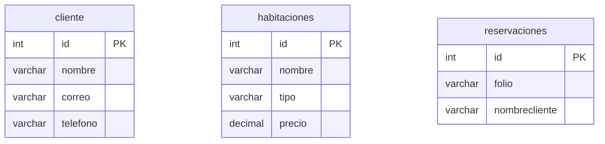

## Overview

The Hotel Reservation System uses MySQL as its relational database management system. This guide covers the complete database setup, including schema creation, connection configuration, and data management.

<Note>
  The database is named `BDReservacion` and contains three main tables: `cliente`, `habitaciones`, and `reservaciones`.
</Note>

## Database Architecture

The system uses a simple, normalized database structure:



<Warning>
  This schema uses `nombrecliente` (string) instead of a foreign key relationship. Consider normalizing this in production by linking to `cliente.id`.
</Warning>

## Creating the Database

<Steps>
  <Step title="Connect to MySQL">
    Open your terminal or MySQL Workbench and connect to MySQL:
    
    ```bash
    mysql -u root -p
    ```
    
    Enter your MySQL root password when prompted.
    
    <Tip>
      If you're using MySQL Workbench, create a new connection to localhost:3306 instead.
    </Tip>
  </Step>

  <Step title="Create the Database">
    Create the database for the application:
    
    ```sql
    CREATE DATABASE BDReservacion;
    ```
    
    Verify the database was created:
    
    ```sql
    SHOW DATABASES;
    ```
    
    You should see `BDReservacion` in the list.
  </Step>

  <Step title="Select the Database">
    Switch to the newly created database:
    
    ```sql
    USE BDReservacion;
    ```
    
    You should see:
    ```
    Database changed
    ```
  </Step>

  <Step title="Create Tables">
    Create all three tables with the proper schema:
    
    ```sql
    -- Create cliente table
    CREATE TABLE cliente (
        id INT AUTO_INCREMENT PRIMARY KEY,
        nombre VARCHAR(255) NOT NULL,
        correo VARCHAR(255) NOT NULL,
        telefono VARCHAR(20) NOT NULL
    ) ENGINE=InnoDB DEFAULT CHARSET=utf8mb4 COLLATE=utf8mb4_unicode_ci;
    
    -- Create habitaciones table
    CREATE TABLE habitaciones (
        id INT AUTO_INCREMENT PRIMARY KEY,
        nombre VARCHAR(255) NOT NULL,
        tipo VARCHAR(100) NOT NULL,
        precio DECIMAL(10, 2) NOT NULL
    ) ENGINE=InnoDB DEFAULT CHARSET=utf8mb4 COLLATE=utf8mb4_unicode_ci;
    
    -- Create reservaciones table
    CREATE TABLE reservaciones (
        id INT AUTO_INCREMENT PRIMARY KEY,
        folio VARCHAR(50) NOT NULL,
        nombrecliente VARCHAR(255) NOT NULL
    ) ENGINE=InnoDB DEFAULT CHARSET=utf8mb4 COLLATE=utf8mb4_unicode_ci;
    ```
    
    <Note>
      We use `utf8mb4` for full Unicode support, including emojis and special characters.
    </Note>
  </Step>

  <Step title="Verify Table Creation">
    Check that all tables were created successfully:
    
    ```sql
    SHOW TABLES;
    ```
    
    Expected output:
    ```
    +-------------------------+
    | Tables_in_BDReservacion |
    +-------------------------+
    | cliente                 |
    | habitaciones            |
    | reservaciones           |
    +-------------------------+
    ```
    
    View table structures:
    ```sql
    DESCRIBE cliente;
    DESCRIBE habitaciones;
    DESCRIBE reservaciones;
    ```
  </Step>
</Steps>

## Table Schemas

Let's examine each table in detail:

### Cliente Table

Stores customer information for the hotel.

```sql
CREATE TABLE cliente (
    id INT AUTO_INCREMENT PRIMARY KEY,
    nombre VARCHAR(255) NOT NULL,
    correo VARCHAR(255) NOT NULL,
    telefono VARCHAR(20) NOT NULL
);
```

**Field Descriptions:**

| Field | Type | Description |
|-------|------|-------------|
| `id` | INT | Auto-incrementing primary key |
| `nombre` | VARCHAR(255) | Client's full name |
| `correo` | VARCHAR(255) | Client's email address |
| `telefono` | VARCHAR(20) | Client's phone number |

**Used in:** `controllers/clientes.controllers.js:4,13,23,32`

<CodeGroup>
  ```sql Insert Example
  INSERT INTO cliente (nombre, correo, telefono) 
  VALUES ('Juan Perez', '[email protected]', '555-1234');
  ```
  
  ```javascript Controller Usage
  // From clientes.controllers.js:13
  const { nombre, correo, telefono } = req.body;
  const SQL = "INSERT INTO `cliente` (nombre, correo, telefono) VALUES (?, ?, ?)";
  conexion.query(SQL, [nombre, correo, telefono], (err, results) => {
      if (err) throw err;
      res.json({ message: "Cliente agregado" });
  });
  ```
</CodeGroup>

### Habitaciones Table

Stores hotel room information.

```sql
CREATE TABLE habitaciones (
    id INT AUTO_INCREMENT PRIMARY KEY,
    nombre VARCHAR(255) NOT NULL,
    tipo VARCHAR(100) NOT NULL,
    precio DECIMAL(10, 2) NOT NULL
);
```

**Field Descriptions:**

| Field | Type | Description |
|-------|------|-------------|
| `id` | INT | Auto-incrementing primary key |
| `nombre` | VARCHAR(255) | Room name or number (e.g., "Suite 101") |
| `tipo` | VARCHAR(100) | Room type (e.g., "Suite", "Standard", "Deluxe") |
| `precio` | DECIMAL(10,2) | Price per night with two decimal places |

**Used in:** `controllers/habitaciones.controllers.js:4,13,23,32`

<CodeGroup>
  ```sql Insert Example
  INSERT INTO habitaciones (nombre, tipo, precio) 
  VALUES ('Suite 101', 'Suite', 150.00);
  ```
  
  ```javascript Controller Usage
  // From habitaciones.controllers.js:12
  const { nombre, tipo, precio } = req.body;
  const SQL = "INSERT INTO `habitaciones` (nombre, tipo, precio) VALUES (?, ?, ?)";
  conexion.query(SQL, [nombre, tipo, precio], (err, results) => {
      if (err) throw err;
      res.json({ message: "hanitacion agregado" });
  });
  ```
</CodeGroup>

### Reservaciones Table

Stores reservation information.

```sql
CREATE TABLE reservaciones (
    id INT AUTO_INCREMENT PRIMARY KEY,
    folio VARCHAR(50) NOT NULL,
    nombrecliente VARCHAR(255) NOT NULL
);
```

**Field Descriptions:**

| Field | Type | Description |
|-------|------|-------------|
| `id` | INT | Auto-incrementing primary key |
| `folio` | VARCHAR(50) | Reservation reference number |
| `nombrecliente` | VARCHAR(255) | Name of the client making the reservation |

**Used in:** `controllers/reservaciones.controllers.js:5,15,31,45`

<CodeGroup>
  ```sql Insert Example
  INSERT INTO reservaciones (folio, nombrecliente) 
  VALUES ('RES-001', 'Juan Perez');
  ```
  
  ```javascript Controller Usage
  // From reservaciones.controllers.js:14
  const { folio, nombrecliente } = req.body;
  const SQL = "INSERT INTO `reservaciones` (folio, nombrecliente) VALUES (?, ?, ?)";
  conexion.query(SQL, [folio, nombrecliente], (err, results) => {
      if (err) {
          console.error(err);
          res.status(500).json({ message: "Error al guardar reservación" });
      } else {
          res.json({ message: "Reservación agregada correctamente" });
      }
  });
  ```
</CodeGroup>

<Note>
  The reservaciones table is simplified. In a production environment, you would typically include:
  - Foreign key to `cliente.id`
  - Foreign key to `habitaciones.id`
  - Check-in and check-out dates
  - Reservation status
  - Total price
  - Number of guests
</Note>

## Database Connection Configuration

The application connects to MySQL using the configuration in `model/database.js`.

### Connection File Structure

```javascript model/database.js
//Paso 1: Crear el objeto "mysql2"
const mysql = require('mysql2');

//Paso 2: Crear el objeto de conexion.
const conexion = mysql.createConnection({
    host: 'localhost',
    user: 'root',
    password: '1234',
    database: 'BDReservacion'
})

//Paso 3: Establecer la conexiona a la base de datos.
conexion.connect((err) =>{
    if (err) throw err;
    console.log("Conexion exitosa a la base de datos")
})

//Paso 4: Exportar el objeto: db, para ser usado en otros archivos.
module.exports = conexion;
```

### Configuration Parameters

| Parameter | Default | Description |
|-----------|---------|-------------|
| `host` | `localhost` | MySQL server hostname or IP address |
| `user` | `root` | MySQL username |
| `password` | `1234` | MySQL password |
| `database` | `BDReservacion` | Database name to connect to |

<Warning>
  Never commit database credentials to version control. Use environment variables for sensitive information in production.
</Warning>

### Customizing the Connection

<Tabs>
  <Tab title="Basic Configuration">
    Update `model/database.js` with your credentials:
    
    ```javascript model/database.js
    const mysql = require('mysql2');
    
    const conexion = mysql.createConnection({
        host: 'localhost',
        user: 'your_username',
        password: 'your_password',
        database: 'BDReservacion'
    });
    
    conexion.connect((err) =>{
        if (err) throw err;
        console.log("Conexion exitosa a la base de datos")
    });
    
    module.exports = conexion;
    ```
  </Tab>
  
  <Tab title="With Port Specification">
    If MySQL is running on a non-standard port:
    
    ```javascript model/database.js
    const mysql = require('mysql2');
    
    const conexion = mysql.createConnection({
        host: 'localhost',
        port: 3306,  // MySQL default port
        user: 'root',
        password: '1234',
        database: 'BDReservacion'
    });
    
    conexion.connect((err) =>{
        if (err) throw err;
        console.log("Conexion exitosa a la base de datos")
    });
    
    module.exports = conexion;
    ```
  </Tab>
  
  <Tab title="Remote Database">
    For connecting to a remote MySQL server:
    
    ```javascript model/database.js
    const mysql = require('mysql2');
    
    const conexion = mysql.createConnection({
        host: 'db.example.com',
        port: 3306,
        user: 'app_user',
        password: 'secure_password',
        database: 'BDReservacion',
        connectTimeout: 10000  // 10 seconds
    });
    
    conexion.connect((err) =>{
        if (err) {
            console.error('Database connection failed:', err);
            throw err;
        }
        console.log("Conexion exitosa a la base de datos")
    });
    
    module.exports = conexion;
    ```
  </Tab>
  
  <Tab title="With Environment Variables">
    Using environment variables (recommended for production):
    
    ```javascript model/database.js
    const mysql = require('mysql2');
    
    const conexion = mysql.createConnection({
        host: process.env.DB_HOST || 'localhost',
        port: process.env.DB_PORT || 3306,
        user: process.env.DB_USER || 'root',
        password: process.env.DB_PASSWORD || '1234',
        database: process.env.DB_NAME || 'BDReservacion'
    });
    
    conexion.connect((err) =>{
        if (err) {
            console.error('Database connection failed:', err);
            throw err;
        }
        console.log("Conexion exitosa a la base de datos")
    });
    
    module.exports = conexion;
    ```
    
    Create a `.env` file:
    ```bash .env
    DB_HOST=localhost
    DB_PORT=3306
    DB_USER=root
    DB_PASSWORD=your_password
    DB_NAME=BDReservacion
    ```
    
    Install dotenv:
    ```bash
    npm install dotenv
    ```
    
    Load in `server.js`:
    ```javascript
    require('dotenv').config();
    ```
  </Tab>
</Tabs>

## Seeding Sample Data

Populate the database with test data for development:

### Insert Sample Clients

```sql
INSERT INTO cliente (nombre, correo, telefono) VALUES
('Juan Perez', '[email protected]', '555-0101'),
('Maria Garcia', '[email protected]', '555-0102'),
('Carlos Rodriguez', '[email protected]', '555-0103'),
('Ana Martinez', '[email protected]', '555-0104'),
('Luis Hernandez', '[email protected]', '555-0105');
```

### Insert Sample Rooms

```sql
INSERT INTO habitaciones (nombre, tipo, precio) VALUES
('Suite 101', 'Suite', 150.00),
('Standard 102', 'Standard', 80.00),
('Deluxe 201', 'Deluxe', 120.00),
('Standard 202', 'Standard', 80.00),
('Suite 301', 'Suite', 150.00),
('Deluxe 302', 'Deluxe', 120.00),
('Standard 103', 'Standard', 80.00),
('Suite 203', 'Suite', 150.00);
```

### Insert Sample Reservations

```sql
INSERT INTO reservaciones (folio, nombrecliente) VALUES
('RES-001', 'Juan Perez'),
('RES-002', 'Maria Garcia'),
('RES-003', 'Carlos Rodriguez'),
('RES-004', 'Ana Martinez');
```

### Verify Sample Data

```sql
SELECT COUNT(*) as total_clientes FROM cliente;
SELECT COUNT(*) as total_habitaciones FROM habitaciones;
SELECT COUNT(*) as total_reservaciones FROM reservaciones;
```

## Database Management

### Useful SQL Queries

<CodeGroup>
  ```sql View All Data
  -- View all clients
  SELECT * FROM cliente;
  
  -- View all rooms
  SELECT * FROM habitaciones;
  
  -- View all reservations
  SELECT * FROM reservaciones;
  ```
  
  ```sql Filter and Search
  -- Find client by email
  SELECT * FROM cliente WHERE correo = '[email protected]';
  
  -- Find rooms by type
  SELECT * FROM habitaciones WHERE tipo = 'Suite';
  
  -- Find rooms under $100
  SELECT * FROM habitaciones WHERE precio < 100.00;
  
  -- Search clients by name (partial match)
  SELECT * FROM cliente WHERE nombre LIKE '%Juan%';
  ```
  
  ```sql Aggregate Queries
  -- Count total clients
  SELECT COUNT(*) as total FROM cliente;
  
  -- Average room price
  SELECT AVG(precio) as promedio FROM habitaciones;
  
  -- Rooms grouped by type
  SELECT tipo, COUNT(*) as cantidad, AVG(precio) as precio_promedio
  FROM habitaciones
  GROUP BY tipo;
  
  -- Total reservations by client
  SELECT nombrecliente, COUNT(*) as num_reservaciones
  FROM reservaciones
  GROUP BY nombrecliente;
  ```
  
  ```sql Update Data
  -- Update client information
  UPDATE cliente 
  SET telefono = '555-9999' 
  WHERE id = 1;
  
  -- Update room price
  UPDATE habitaciones 
  SET precio = 160.00 
  WHERE id = 1;
  
  -- Update reservation
  UPDATE reservaciones 
  SET nombrecliente = 'Juan Carlos Perez' 
  WHERE id = 1;
  ```
  
  ```sql Delete Data
  -- Delete a specific client
  DELETE FROM cliente WHERE id = 5;
  
  -- Delete all standard rooms
  DELETE FROM habitaciones WHERE tipo = 'Standard';
  
  -- Delete old reservations
  DELETE FROM reservaciones WHERE folio LIKE 'RES-00%';
  ```
</CodeGroup>

<Warning>
  Always backup your database before running DELETE or UPDATE queries in production.
</Warning>

## Database Backup and Restore

### Creating a Backup

<Tabs>
  <Tab title="Command Line">
    ```bash
    # Backup entire database
    mysqldump -u root -p BDReservacion > backup_$(date +%Y%m%d).sql
    
    # Backup specific tables
    mysqldump -u root -p BDReservacion cliente habitaciones > backup_tables.sql
    
    # Backup with compression
    mysqldump -u root -p BDReservacion | gzip > backup.sql.gz
    ```
  </Tab>
  
  <Tab title="MySQL Workbench">
    1. Open MySQL Workbench
    2. Connect to your database
    3. Go to **Server** > **Data Export**
    4. Select `BDReservacion` database
    5. Choose export options:
       - Export to Dump Project Folder
       - Or Export to Self-Contained File
    6. Click **Start Export**
  </Tab>
</Tabs>

### Restoring from Backup

<Tabs>
  <Tab title="Command Line">
    ```bash
    # Restore from backup
    mysql -u root -p BDReservacion < backup_20260313.sql
    
    # Restore from compressed backup
    gunzip < backup.sql.gz | mysql -u root -p BDReservacion
    
    # Restore to a new database
    mysql -u root -p -e "CREATE DATABASE BDReservacion_restore;"
    mysql -u root -p BDReservacion_restore < backup_20260313.sql
    ```
  </Tab>
  
  <Tab title="MySQL Workbench">
    1. Open MySQL Workbench
    2. Connect to your database
    3. Go to **Server** > **Data Import**
    4. Select import options:
       - Import from Dump Project Folder
       - Or Import from Self-Contained File
    5. Select the backup file
    6. Choose target database
    7. Click **Start Import**
  </Tab>
</Tabs>

## Database Security

### Create a Dedicated User

Instead of using root, create a dedicated user for the application:

```sql
-- Create new user
CREATE USER 'hotel_app'@'localhost' IDENTIFIED BY 'secure_password';

-- Grant necessary permissions
GRANT SELECT, INSERT, UPDATE, DELETE ON BDReservacion.* TO 'hotel_app'@'localhost';

-- Apply changes
FLUSH PRIVILEGES;

-- Verify permissions
SHOW GRANTS FOR 'hotel_app'@'localhost';
```

Update `model/database.js`:
```javascript
const conexion = mysql.createConnection({
    host: 'localhost',
    user: 'hotel_app',
    password: 'secure_password',
    database: 'BDReservacion'
});
```

<Tip>
  This follows the principle of least privilege - the application user only has the permissions it needs.
</Tip>

## Troubleshooting

<AccordionGroup>
  <Accordion title="Can't connect to MySQL server">
    Check if MySQL is running:
    
    ```bash
    # Linux
    sudo systemctl status mysql
    
    # macOS
    brew services list
    
    # Windows
    services.msc  # Look for MySQL
    ```
    
    Verify connection parameters in `model/database.js`
  </Accordion>

  <Accordion title="Access denied for user 'root'@'localhost'">
    Password is incorrect. Reset it:
    
    ```bash
    # Stop MySQL
    sudo systemctl stop mysql
    
    # Start in safe mode
    sudo mysqld_safe --skip-grant-tables &
    
    # Connect without password
    mysql -u root
    
    # Reset password
    FLUSH PRIVILEGES;
    ALTER USER 'root'@'localhost' IDENTIFIED BY 'new_password';
    
    # Restart MySQL normally
    sudo systemctl start mysql
    ```
  </Accordion>

  <Accordion title="Table doesn't exist error">
    Verify you're in the correct database:
    
    ```sql
    SELECT DATABASE();
    USE BDReservacion;
    SHOW TABLES;
    ```
  </Accordion>

  <Accordion title="Connection timeout errors">
    Increase timeout in `model/database.js`:
    
    ```javascript
    const conexion = mysql.createConnection({
        host: 'localhost',
        user: 'root',
        password: '1234',
        database: 'BDReservacion',
        connectTimeout: 60000  // 60 seconds
    });
    ```
  </Accordion>
</AccordionGroup>

## Next Steps

<CardGroup cols={2}>
  <Card title="Configuration" icon="gear" href="/setup/configuration">
    Configure server settings and environment variables
  </Card>
  
  <Card title="API Reference" icon="code" href="/api/overview">
    Learn about API endpoints and database operations
  </Card>
</CardGroup>